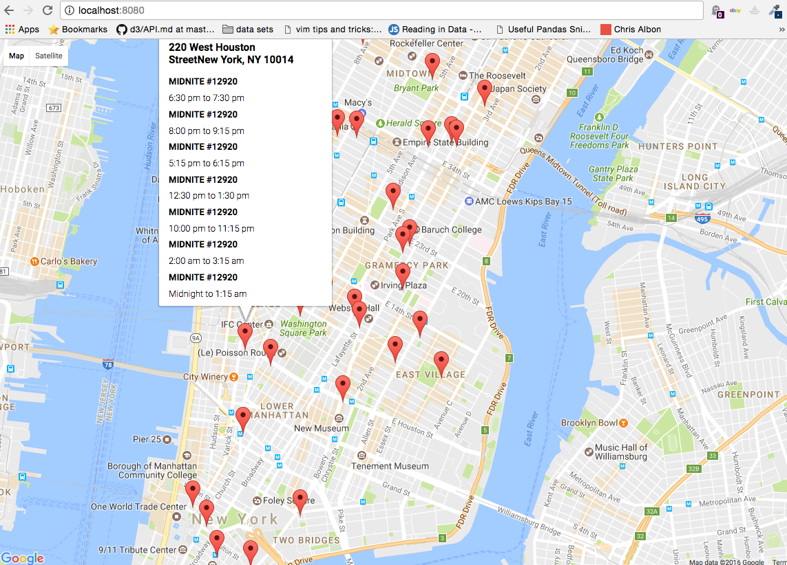

# Data-structures

## Project 1: creating a google maps application from web scraped data
(weeks 1-6)

- For the first project I scraped data from the New York AA meeting website, cleaned and standardized the data.

- Then I used the google maps API to add geo-location (lat and long) to the data and and stored it in a MongoDB database hosted on and aws EC2 instance.

- I then created an aggregation pipeline for the MongoDB server to feed meeting information to a simple front-end google maps application which shows the nearby meetings happening that day.

## Project 2: Creating a public facing API for visualizing data from a hand activity tracking device I made.
(weeks7-10)

- I used a 3 axis Accelerometer to measure the movements of an artists hand while folding an origami model. 
The sensor data was fed directly to a PostgreSQL database on an AWS Relational Database Service (RDS) instance I set up.

- To follow up I created a simple API which returned a json document for the data for whatever model or activity a developer requests.

- Finally I designed simple example use case for the data and API querying the API and plotting the data using matplotlib and D3.

Here is a chart of the Latency for Mongodb queries from the Google Maps project:(week5)
https://ianssmith.github.io/data-structures/week5/latencyViz/

Postgres api URI (week10[no-longer live]):
https://postgres-api-ianssmith.c9users.io/model/crane
-To access data type in the above URI and append the desired model 
you would like to see (in place of 'crane' in the above example)
