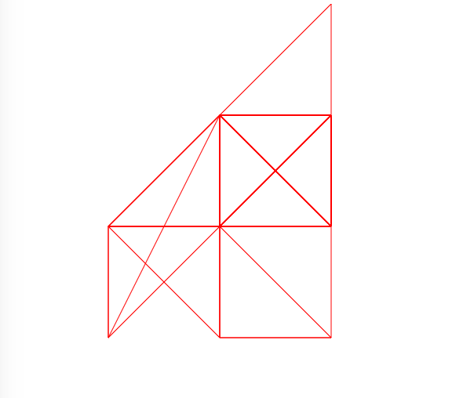

# Data-structures

##Project 1:
(weeks 1-6)

-For the first project I scraped data from the New York AA meeting website, cleaned and standerdized the data and stored it in a MongoDB database.

-We then created an mongo aggregation pipeline to feed meeting information to a simple front-end google maps application which shows the nearby meetings happening that day.

##Project 2:
(weeks7-10)

-I used a 3 axis Accelerometer to measure the movements of an artists hand while folding an origami model. 
The sensor data was fed directly to a Postgresql database on an AWS Relational Database Service (RDS) instance.

-To follow up I created a simple API which returned a json document for the data for whatever model a developer requests.

-Finally I designed simple example use case for the data and API plotting the data continuously.

Latency viz for Mongodb queries:(week5)
https://ianssmith.github.io/data-structures/week5/latencyViz/

postgres api URI (week10[no-longer live]):
https://postgres-api-ianssmith.c9users.io/model/crane
-To access data type in the above URI and append the desired model 
you would like to see (in place of 'crane' in the above example)
