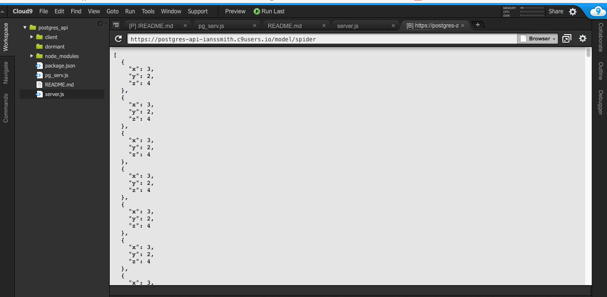

## Final API for sensor data:
queries return the requested model and x,y,z acceleration measurments.

-The design for the visualization is simple; The data values for the x,y,z acceleration are simple integer values from 0 up, so the corresponding visualizations have a similar reductive simplicity. 

The sensor took readings 3 time per second, and each of the axis values for every read instance are used to plot a continous path from beginning to end. With D3 I plotted only X and Y, but for the final design I would use WebGL and threeJS to acheive the 3D model shown in the screenshot (week7/) made with matplotlib.

[Live example can be found in my cloud9 env](https://postgres-api-ianssmith.c9users.io/model/crane)
first launch the cloud9 "server.js" file and then run $ node pg_serv.js and it should work

