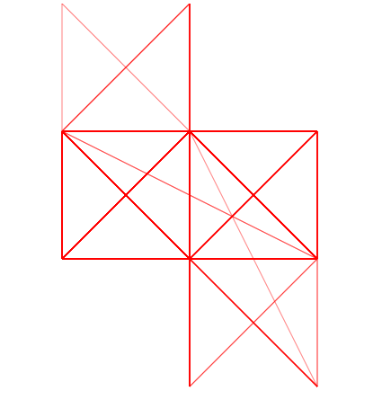
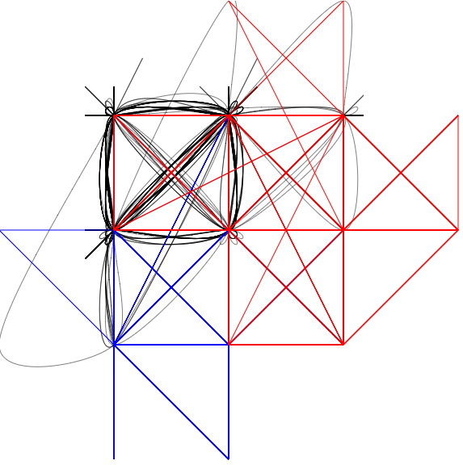
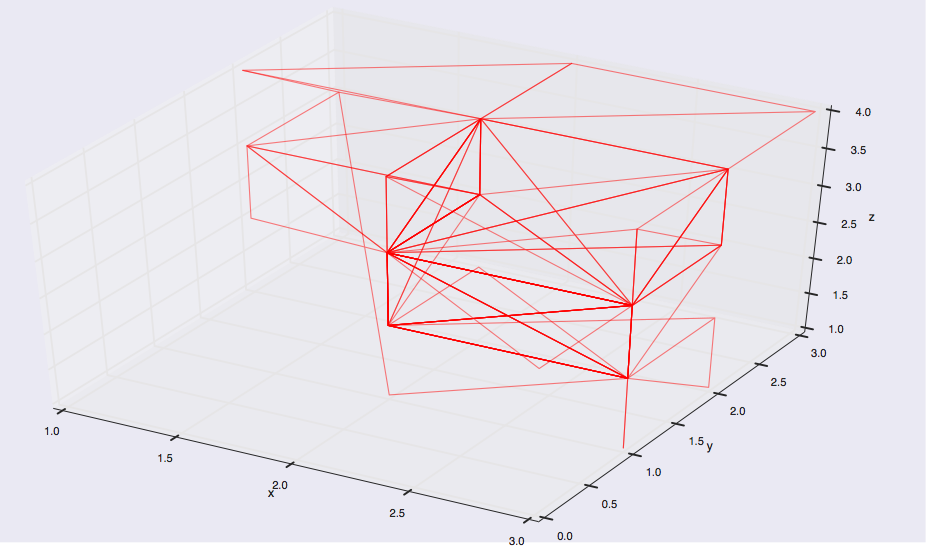
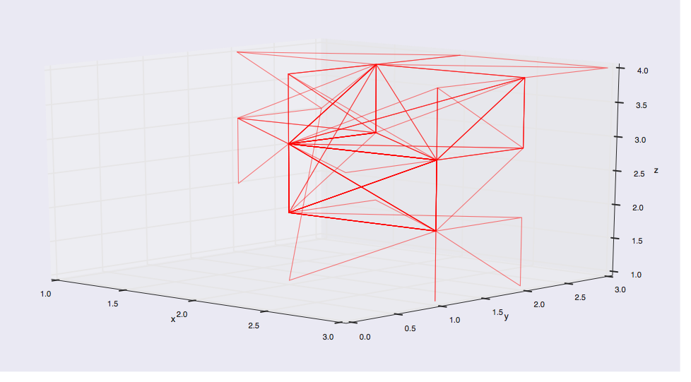

ScreenShots of what the shape the visualization of the sensor data would take:

It probably could have been predicted, the form the plot might take, given the data, however I still was rather surprised and pleased by the simple and clean looking result.

This was just plotting the X and Y acceleration as a continuous line with d3 Path.

After fiddling around with various ways to try and depict the 3 dimensions in 2D

I finally threw in the towl and just used matplotlib to give a full 3d rendering.

